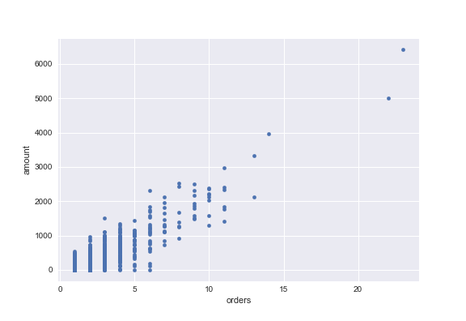
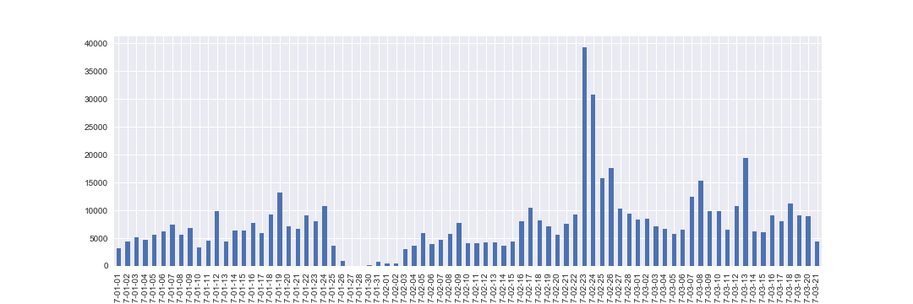
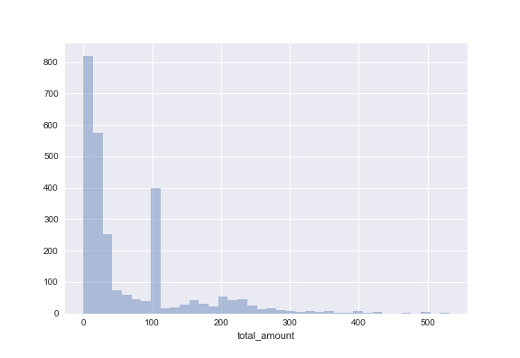
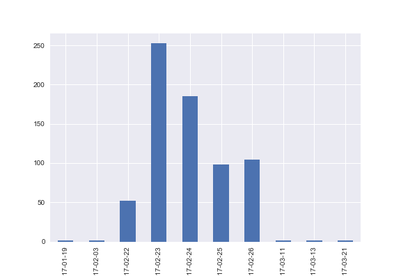
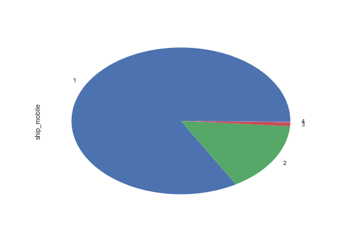
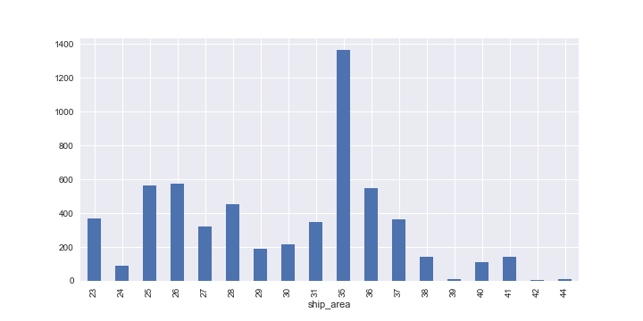
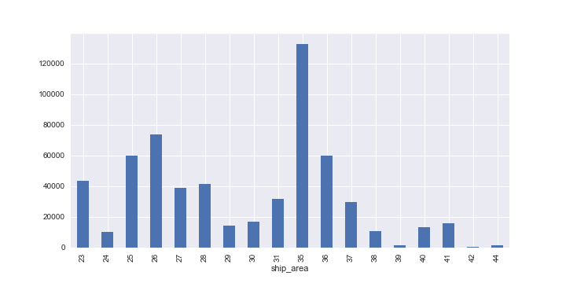
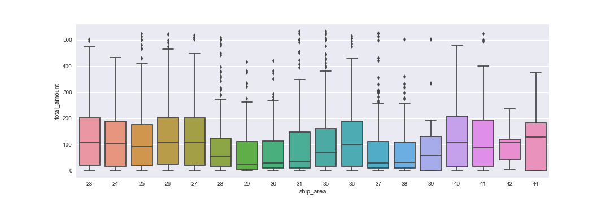
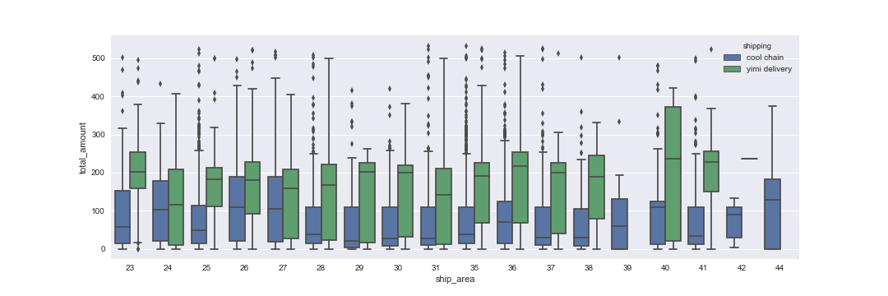
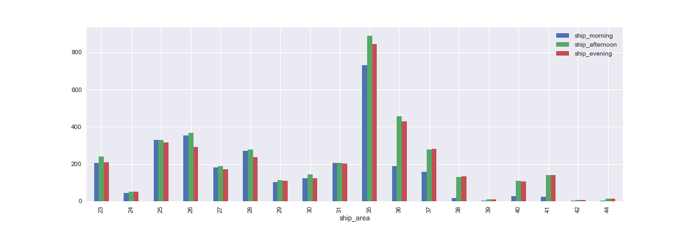

# 数据分析

- [这是](test_data.xls)一份面试考题，测试应试者数据整理、分析、报告的能力。
- 尝试[练习](data-analysis.ipynb)，得到以下内容。

## 整理

- 档案为 Excel 格式
- 总共有 72 个字段
- 扣除杂讯、无关分析、重复信息、无识别度，剩下 44 个字段
- 送货地区（ship_area）：重新编码，其中奉贤区(39,48)、南汇区(42,46)重复取其一
- 送货时段（ship_time）：重新编码，分成早（08:00-12:00）、中（14:00-18:00）、晚（18:00-21:00）三个时段，部分订单横跨多个时段
- 订单时间（createtime、last_modified）：转成日期，方便分析
- 运送方式（shipping）：重新编码，中文转英文（图片不支持中文）
- 折扣（discount）：转换成整数
- 订单金额（total_amount）：过滤奇异值

## 统计观察

### 客户

以手机定义客户身份，总数 3778

#### 常客 Top 5

手机号码 | 消费次数
---|---
17166769648 |   23
16143545425 |   22
16143452034 |   14
17131246473 |   13
17188915242 |   13

#### 订单数 vs. 消费总额

### 消费

总营业额: 596657.6

#### 统计叙述

叙述 | 数值
---|---
count |   5821.000000
mean |     102.500877
std |      106.008417
min |        0.000000
25% |       15.800000
50% |       76.000000
75% |      171.020000
max |      532.930000

#### 每日营业额

#### 消费力 Top 5

消费 Top 5

手机 | 总金额
---|---
17166769648 |   6420.86
16143545425 |   5002.66
16143452034 |   3969.50
17131246473 |   3332.54
16104542317 |   2983.37

- 客户 17166769648 订单数23，总消费金额6420.86，绝对是VIP

#### 常客分析

- 常客（购买两次以上）比例：29.30%
- 回头客比例太低

#### 单次购买客户消费金额分布

单次购买最常出现的结账金额:

结账金额 | 次数
---|---
109.0 |  351
0.0   |  202
20.0  |  137
18.0  |   77
10.0  |   66

- 109.0 可能是某次促销活动

#### 追踪消费金额109.0的客户

- 109.0 订单时间集中在 2/22 ~ 2/26，应该是某种促销

#### 参与 109.0 促销活动的客户的购买次数

- 促销活动转化效果不佳？

## 地区

区码 | 23| 24| 25| 26| 27| 28| 29| 30| 31| 35| 36| 37| 38| 39| 40| 41| 42| 44
----|---|---|---|---|---|---|---|---|---|---|---|---|---|---|---|---|---|---
地区 | 黄浦区| 卢湾区| 徐汇区| 长宁区| 静安区| 普陀区| 闸北区| 虹口区| 杨浦区| 浦东新区| 闵行区| 宝山区| 嘉定区| 奉贤区| 青浦区| 松江区| 南汇区| 金山区

> matplotlib 画图中文化不给力，暂时用区码替代

### 各地区消费次数

- 35（浦东新区）产生大量订单

#### 各地区消费总额

- 35（浦东新区）贡献很多营业额

#### 各地区消费力分析

- 29（闸北区）、30（虹口区）、31（杨浦区）、37（宝山区）、38（嘉定区）消费力中位数低于其他地区

#### 各地区消费力分析（区分运送方式）

- 各区直送的比例高于冷链

### 配送时段

时段 | 次数
---|---
morning   | 2975
afternoon | 3951
evening   |  3673

#### 地区 vs. 时段

- 不同地区不同收件时段
- 38（嘉定）、40（青浦）、41（松江）午后收件占大部分，可能大多为上班族
